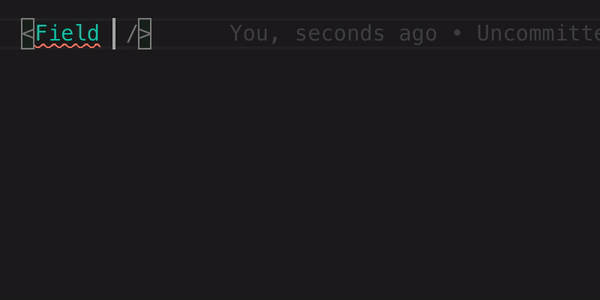

## Typed-safe Formik `<Field>` etc example

Example of using TypeScript 4.1 [Template Literal Types](https://devblogs.microsoft.com/typescript/announcing-typescript-4-1/#template-literal-types) to give us a type safe usage of [Formik](https://formik.org/) `<Field>`s' `name`-attribute (& `useField` & `<ErrorMessage />`).




> (Does not cover array fields)


## How the form component uses it

```tsx
// Set the initial values
const initialValues = {
  name: "",
  social: {
    facebook: "",
    twitter: "",
  },
};

// Create type safe helper components
const { Field, ErrorMessage, useField } = typedFormik({
  initialValues,
});

// in component:
<Field name='social.twitter' />
```
### View code

- [`pages/index.tsx`](./pages/index.tsx)
- [`utils/typedFormik.tsx`](./utils/typedFormik.tsx)
- [`utils/types.ts`](./utils/types.ts)

### Play with it

```bash
git clone git@github.com:KATT/typed-form.git cd typed-form && yarn && yarn dev
```

---

Created by [@alexdotjs](https://twitter.com/alexdotjs). Credits to [Craig](https://twitter.com/phenomnominal) who wrote [this article](https://dev.to/phenomnominal/i-need-to-learn-about-typescript-template-literal-types-51po).
